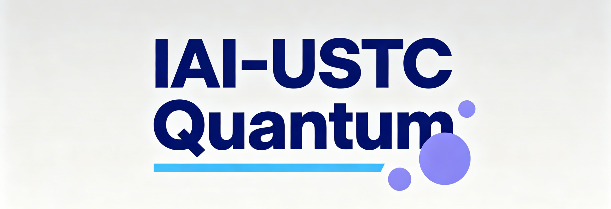

  

# IAI-USTC Quantum

 

**Quantum AI Group** from **Institute of Artificial Intelligence, Hefei Comprehensive National Science Center**.

Welcome to our research team focusing on quantum computing, quantum algorithms, and quantum AI.

## 🏛️ About Team

- **Chinese Name**: 合肥综合性国家科学中心人工智能研究院 · 量子人工智能团队
- **English Name**: Institute of Artificial Intelligence, Hefei Comprehensive National Science Center · Quantum AI Group
- **Website**: [https://iai.ustc.edu.cn](https://iai.ustc.edu.cn)

## 🚀 Projects

| Project | Description |
|---------|-------------|
| [QRAM-Simulator](https://github.com/IAI-USTC-Quantum/QRAM-Simulator) | Quantum Random Access Memory simulator for quantum data storage and retrieval research |
| [QPanda-lite](https://github.com/Agony5757/QPanda-lite) | A python-native version for pyqpanda. Simple, easy, and transparent. |

## 👥 Team Members

| Member | GitHub |
|--------|--------|
| Agony5757 | [@Agony5757](https://github.com/Agony5757) |
| TMYTiMidlY | [@TMYTiMidlY](https://github.com/TMYTiMidlY) |
| YunJ1e | [@YunJ1e](https://github.com/YunJ1e) |
| RichardSun2019 | [@RichardSun2019](https://github.com/RichardSun2019) |
| yowakkojay | [@yowakkojay](https://github.com/yowakkojay) |

## 📬 Contact

- Email: [chenzhaoyun@iai.ustc.edu.cn](mailto:chenzhaoyun@iai.ustc.edu.cn)
- GitHub: [IAI-USTC-Quantum](https://github.com/IAI-USTC-Quantum)

---

*Advancing quantum AI research.*
